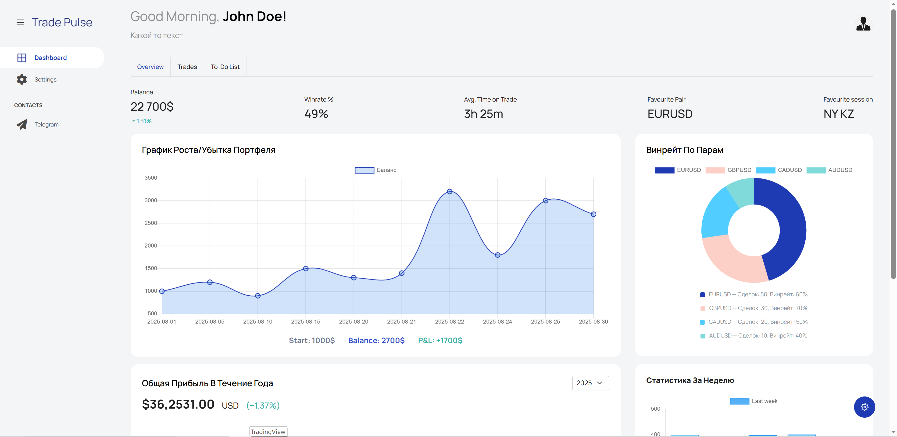
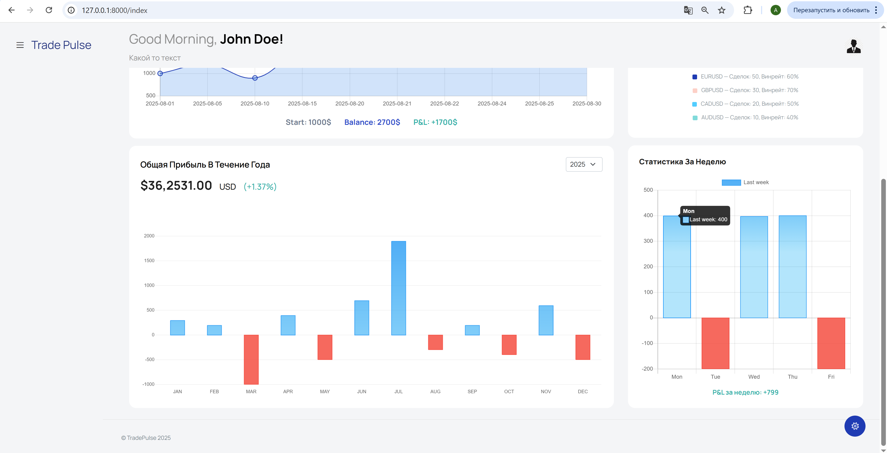
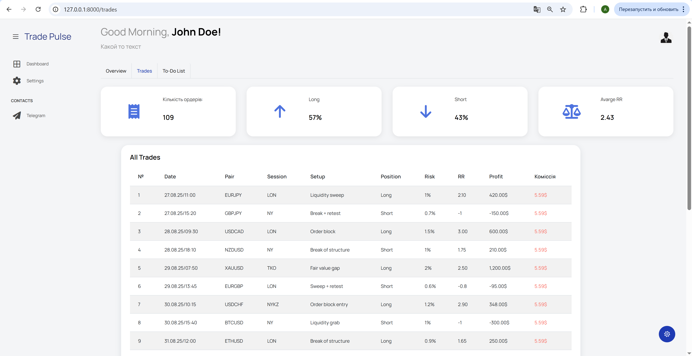

# Trading Journal

Описание проекта:  
Автоматизований журнал торгових угод з елементами аналізу. 
Проект надає метрики та статистику на основі отриманих угод, автоматично обробляючи дані для зручності трейдера та аналізу торгових стратегій.

## Функціонал та особливості
- Ведення журналу торгових угод
- Автоматичний розрахунок метрик
- Аналіз торгової стратегії
- Вбудовані інструменти для статистики

## Технології
- Python
- FastAPI
- PostgreSQL
- SQLAlchemy

Планую додати: 
- Redis
- Celery

## Установка та запуск
В процесі розробки.

**Example:**

GET /index

GET /trades

Далі більше...